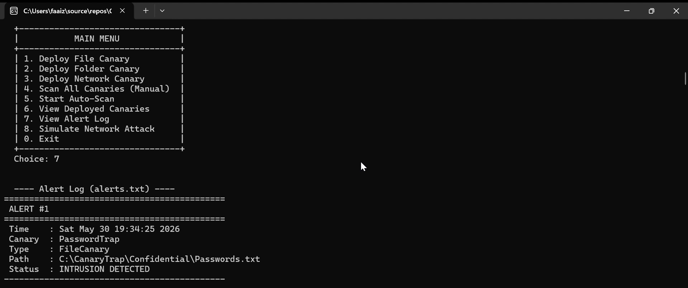
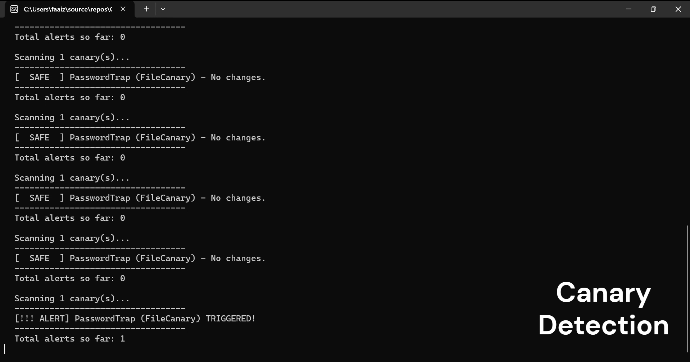

# Canary Forensic Detection System

A deceptive cyber defense tool built in C++ using OOP.

## Features
- File & Folder monitoring
- Network intrusion detection
- Real-time alert logging
- Multi-component architecture

## Tech Stack
- C++ (OOP — Inheritance, Polymorphism)
- Socket Programming
- File System API

## Demo
[Watch Demo Video](https://drive.google.com/file/d/1D-KJeoBBJm1nHLQ1M_3qGprtRBHpeU79/view?usp=sharing)

## Screenshots

### Alert Log — Intrusion Detected

### Live Auto-Scan Detection

## Documentation
[Full Project Report (PDF)](https://github.com/sana-rahat/canary-forensic-detection/blob/main/OOP%20Report.pdf)

## Author
Sana Ashfaq Rahat
BS Cyber Forensics & Security | Air University Islamabad
